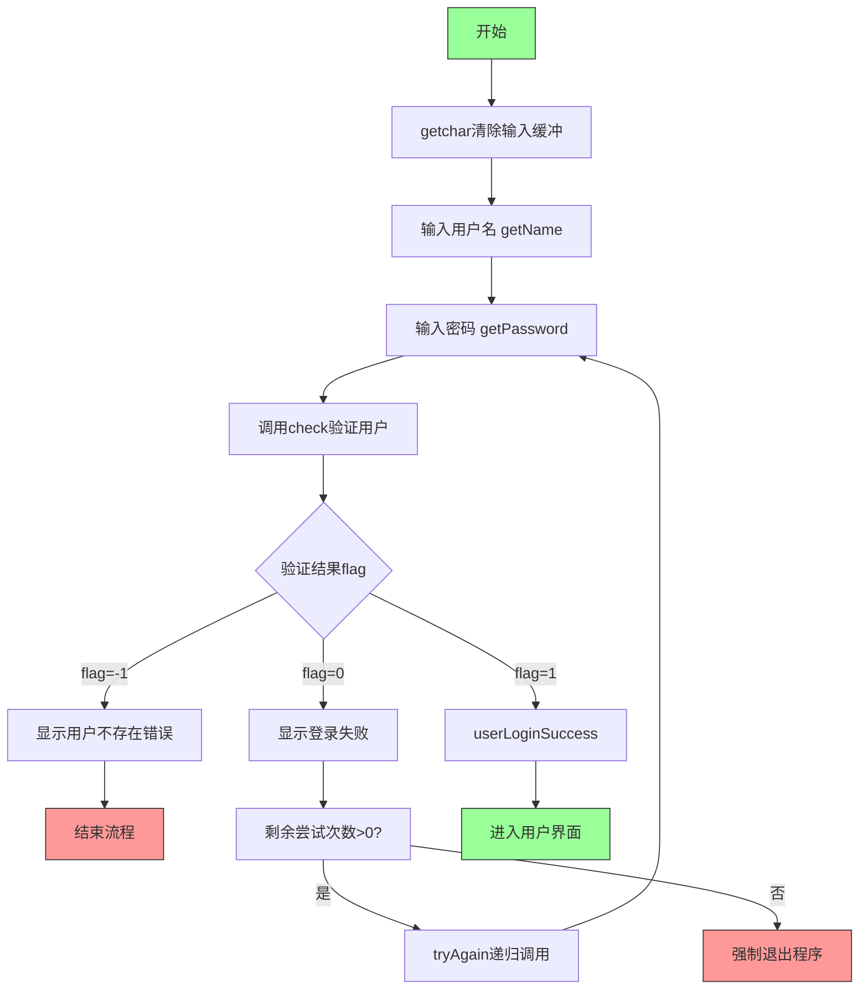

```mermaid
flowchart TD
    A[开始] --> B[getchar清除输入缓冲]
    B --> C[输入用户名 getName]
    C --> D[输入密码 getPassword]
    D --> E[调用check验证用户]
    E --> F{验证结果flag}
    
    F --> |flag=-1| G[显示用户不存在错误]
    G --> H[结束流程]
    
    F --> |flag=0| I[显示登录失败]
    I --> J[剩余尝试次数>0?]
    J --> |是| K[tryAgain递归调用]
    K --> D
    J --> |否| L[强制退出程序]
    
    F --> |flag=1| M[userLoginSuccess]
    M --> N[进入用户界面]
    
    style A fill:#9f9,stroke:#333
    style H fill:#f99,stroke:#333
    style L fill:#f99,stroke:#333
    style N fill:#9f9,stroke:#333
```
