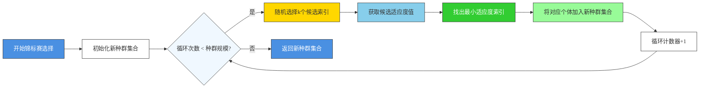

```mermaid
graph LR
    A[开始锦标赛选择] --> B[初始化新种群集合]
    B --> C{循环次数 < 种群规模?}
    C --> |是| D[随机选择k个候选索引]
    D --> E[获取候选适应度值]
    E --> F[找出最小适应度索引]
    F --> G[将对应个体加入新种群集合]
    G --> H[循环计数器+1]
    H --> C
    C --> |否| I[返回新种群集合]

    style A fill:#4A90E2,stroke:#333,color:white
    style I fill:#4A90E2,stroke:#333,color:white
    style D fill:#FFD700,stroke:#333
    style E fill:#87CEEB,stroke:#333
    style F fill:#32CD32,stroke:#333,color:white
    style C fill:#F0F8FF,stroke:#333
    style G fill:#98FB98,stroke:#333
    classDef default stroke:#333,fill:#fff,font-family:Microsoft YaHei;
```

